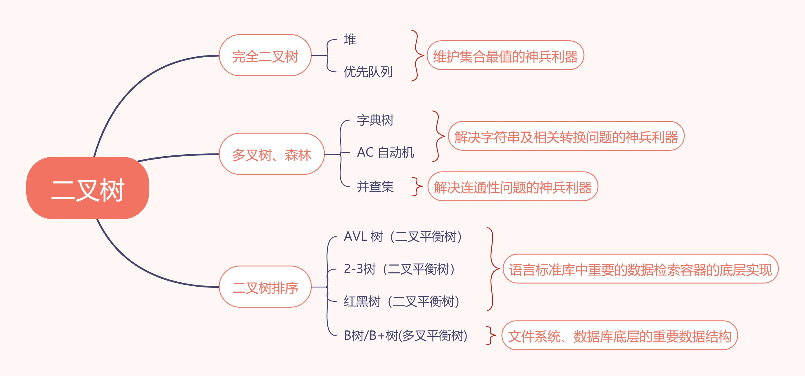

# 二叉树

### 树基础知识：

1. 每个节点有多个指针域的称为树，或者可以认为链表是一种特殊的树形解构
2. 将链表的单个指针域改成数组，即为树
3. 每个节点都只有唯一的一个父节点。
4. 二叉树
   - 每个节点度最多为 2
   - 度为 0 的节点比度为 2 的节点多一个（n 个节点，会有 n-1 条边，点的数量 n0+ n1 + n2,边的数量 n1 + 2n2,即为 n0 = n2 + 1）
   - 重要遍历
     - 前序遍历：根左右
     - 中序遍历：左根右
     - 后序遍历：左右根
     - 中序遍历结果 + 前序/后序结果可以还原一颗二叉树
   - 分类
     - 完全二叉树：只有在最后一层的右侧是缺少节点的，左侧是满节点的
     - 满二叉树：没有度为 1 的节点，只有度为 0 或者度为 2 的节点。
     - 完美二叉树：深度为 k 的所有节点都满了。
    - 完全二叉树：
        1. 编号为`i`的子节点，左孩子编号为：`2i`，右孩子编号为 `2i + 1`
        2. 不需要存储left，right子树地址，可以节省存储空间。记录式（节省时间） --> 计算式（节省空间）
        3. 可以用连续空间存储（数组）

         
### 树的深入理解：
1. 树的节点代表集合
2. 树的边代表关系

### 树实现

1. 见 index.js 生成长度为 n 的随机的二叉树。

### 树的作用
1. 理解高级数据结构的基础
 

### 经典面试题

#### 树的基本操作

3.

#### 树结构的扩展应用

20.
