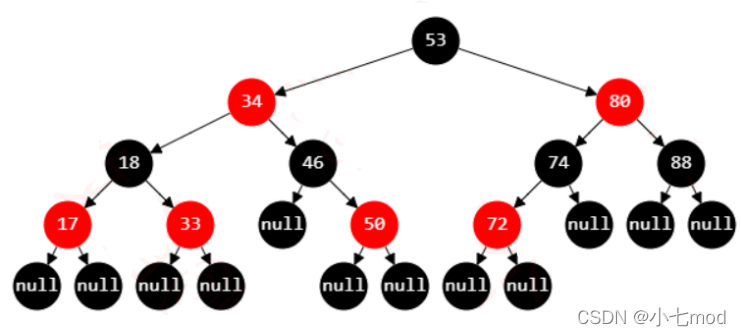

# 红黑树

## 红黑树平衡条件：

1. 每个节点要么是红色，要么是黑色。
2. 根节点是黑色。
3. 每个叶子节点（NIL）是黑色。
4. 如果一个节点是红色的，那么它的子节点必须是黑色的。
5. 从任意一个节点到其每个叶子节点的所有路径都包含相同数目的黑色节点。

- 红黑树中，最长路径和最短路径长度关系？

  最长路径不超过最短路径的二倍，因而近似平衡（最短路径就是全黑节点，最长路径就是一个红节点一个黑节点，当从根节点到叶子节点的路径上黑色节点相同时，最长路径刚好是最短路径的两倍）

- 怎么理解 NIL 节点？

  叶子节点（外部节点，空节点）都是黑色，这里的叶子节点指的是最底层的空节点（外部节点），下图中的那些 null 节点才是叶子节点，null 节点的父节点在红黑树里不将其看作叶子节点
  

## 平衡调整：

- 插入调整站在 祖父节点看，处理冲突
- 删除调整站在 父节点看，处理冲突
- 插入和删除的情况处理一共就五种

## 插入调整

- 新插入的节点是`红色`, 根据特性 5，插入黑色一定引发失衡，插入红色不一定引发失衡。
- 当插入节点的父节点是红色，根据特性 4，则一定会失衡,这时候就需要站被插入节点的祖父节点看，调整颜色和旋转，并保证调整前后路径上的黑色节点数量不变。

从祖父节点看如果失衡了：

1. 父和叔叔都是红色，则父和叔叔都变为黑色，祖父变为红色
2. 父是红色，叔叔是黑色：
   LL：从祖父看，左红，左的左也红，先从祖父级大右旋，然后两种调整策略：红色上浮和红色下沉。
   LR：从祖父看，左红，左的右也红，先从父级小左旋，再从祖父级大右旋，然后同上。
   RR：从祖父看，右红，右的右也红，先从祖父级大左旋，然后同上。
   RL：从祖父看，右红，右的左也红，先从父级小右旋，再从祖父级大左旋，然后同上。
