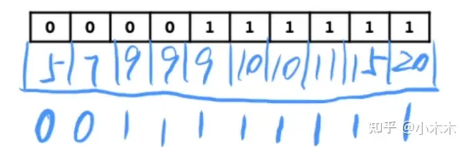

# 二分法
- 二分查找算法
    二分算法分的是查找区间范围，根据头尾获得一个mid，然后比较待查找的值和mid进行比较，确定待查找值的区间。

    二分查找泛型情况-二分模型：可以把泛型情况抽象成下面两种情形
    1. 前面一堆0,后面一堆1，要查找第一个1

    2. 前面一堆1,后面一堆0，要查找最后一个1

    栗子🌰:下面一组数要找到第一个大于等于9的数，就可以转换成下面0,1的问题。 0：条件不成立，1：条件成立。
    

    [代码](./binarySearch01.js)

- 

# 代码

- [二分查找算法](./binarySearch.js)
