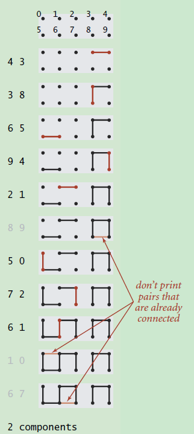
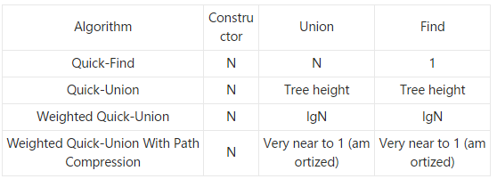

# 并查集及经典问题

[算法 & 并查集（Union-find 算法）](https://blog.csdn.net/ayydead/article/details/107696502)

[算法学习笔记(1) : 并查集](https://zhuanlan.zhihu.com/p/93647900)

### 并查集的基础知识

1. 解决的问题：连通性问题(动态连通性) - 传递性：如果 A 和 B 连通，B 和 C 连通，那么可以推导出 A 和 C 连通 - 对称性：如果 A 和 B 是相连的，那么 B 和 A 是相连的 - 自反性：A 和 A 是相连的
   
2. 维护连通性的关系`Quick-find`
   1. 基于染色的思想，一开始所有点的颜色不同
   2. 连接两个点的操作，看成将一种颜色染成另一种
   3. 如果两个点的颜色一样，证明连通，否则不连通
   4. 这种方法叫做并查集的【Quick-find 算法】
   5. 联通判断 O(1) ,合并操作 O(n)
3. `Quick-Union`算法
   1. 记录每个节点的父节点的编号,形成一个树形结构
   2. 联通判断：tree-height 书稿，合并操作：tree-height 树高
   3. 有效的减少树高能优化操作效率：合并 a 和 b 的子树,节点数多的作为爸爸，进行合并，称为`按秩合并`优化。
   4. `路径压缩`优化

### Quick-find 代码实现

    见quick-find.js

### Quick-union 代码实现

    见quick-union.js

### 算法时间复杂度



### 题库

[#71. 练习题 1：朋友圈](https://oj.haizeix.com/problem/71)

- 结论：merge 确实慢。

### 经典面试题 - 并查集基础题目

547. 省份数量

```ts
function findCircleNum(isConnected: number[][]): number {
  let n = isConnected.length;
  let u = new UnionSet(n);
  for (let i = 0; i < n; i++) {
    for (let j = 0; j < i; j++) {
      if (isConnected[i][j] === 1) {
        u.merge(i, j);
      }
    }
  }
  let ans = 0;
  for (let i = 0; i < n; i++) {
    if (u.get(i) === i) ans += 1;
  }
  return ans;
}
```

200. 岛屿数量

```js
function numIslands(grid: string[][]): number {
  let n = grid.length;
  let m = grid[0].length;
  const u = new UnionSet(n * m);
  function getIndex(i, j) {
    // 转换为编号
    return i * m + j;
  }
  for (let i = 0; i < n; i++) {
    for (let j = 0; j < m; j++) {
      if (grid[i][j] === "0") continue;
      // 当前节点的上下左右的都是1 则进行连接，由于是依次遍历的，实际只需要当前节点的左，上为1 就进行连接
      if (i > 0 && grid[i - 1][j] === "1") {
        // 与上面的点进行连接
        u.merge(getIndex(i, j), getIndex(i - 1, j));
      }
      if (j > 0 && grid[i][j - 1] === "1") {
        // 与左面的点进行连接
        u.merge(getIndex(i, j), getIndex(i, j - 1));
      }
    }
  }
  let ans = 0;
  for (let i = 0; i < n; i++) {
    for (let j = 0; j < m; j++) {
      if (grid[i][j] === "1" && u.get(getIndex(i, j)) === getIndex(i, j))
        ans += 1;
    }
  }
  return ans;
}
```

990. [等式方程的可满足性](https://leetcode.cn/problems/satisfiability-of-equality-equations/)

```ts
function equationsPossible(equations: string[]): boolean {
  // 看各个条件有冲突
  // 相等元素具有连通性，将相等的元素放在一个集合中，如果不等的关系两边都在这个集合中，则冲突

  // 1. 利用相等关系创建并查集，有26个编号
  let u = new UnionSet(26);
  let uneQueal = [];
  for (let i = 0; i < equations.length; i++) {
    let s = equations[i];
    let aCode = getCode("a"); // a换算成数字
    let leftV = getCode(s[0]) - aCode; // a换算成0
    let rightV = getCode(s[3]) - aCode;
    let symbol = s.slice(1, 3);
    if (symbol === "==") {
      u.merge(leftV, rightV);
    } else {
      uneQueal.push([leftV, rightV]);
    }
  }
  for (let i = 0; i < uneQueal.length; i++) {
    let [leftV, rightV] = uneQueal[i];
    if (u.get(leftV) === u.get(rightV)) return false; // 位于同一个并查集
  }
  return true;
}
```

684. [冗余连接](https://leetcode.cn/problems/redundant-connection/)

```ts
function findRedundantConnection(edges: number[][]): number[] {
  // 多的边原本就是连通的，去掉不影响连通性
  let u = new UnionSet(edges.length);
  let ans = [];
  for (let i = 0; i < edges.length; i++) {
    let [point1, point2] = edges[i];
    if (u.get(point1) === u.get(point2)) {
      ans = edges[i];
    } else {
      u.merge(point1, point2);
    }
  }
  return ans;
}
```

1319. [连通网络的操作次数](https://leetcode.cn/problems/number-of-operations-to-make-network-connected/)

```js
function makeConnected(n: number, connections: number[][]): number {
  let u = new UnionSet(n);
  let extra = 0; // 多余的线
  for (let i = 0; i < connections.length; i++) {
    const [a, b] = connections[i];
    if (u.get(a) === u.get(b)) {
      extra += 1;
    } else {
      u.merge(a, b);
    }
  }
  let ans = -1; // 几个跟，或者几个集合 ，每个集合都需要用一根线去链接
  for (let i = 0; i < n; i++) {
    if (u.get(i) === i) {
      ans += 1;
    }
  }
  return ans > extra ? -1 : ans;
}

function makeConnected(n: number, connections: number[][]): number {
  let u = new UnionSet(n);
  if (connections.length < n - 1) return -1; // n台计算机至少需要n-1根线
  for (let i = 0; i < connections.length; i++) {
    const [a, b] = connections[i];
    u.merge(a, b);
  }
  let ans = -1; // 需要连接的的集合
  for (let i = 0; i < n; i++) {
    if (u.get(i) === i) {
      ans += 1;
    }
  }
  return ans;
}
```
128. [最长连续序列](https://leetcode.cn/problems/longest-consecutive-sequence/description/)
```js
function longestConsecutive(nums: number[]): number {
    let numss = new Set(nums.sort((a,b)=>a-b))
    let maxCount = 0
    for(let value of numss){
        let max = 1
        let cur = value
        while(numss.has(cur + 1)){
            numss.delete(cur + 1)
            max++
            cur++
        }
        maxCount = Math.max(maxCount,max)
    }
    return maxCount
};


```
###
