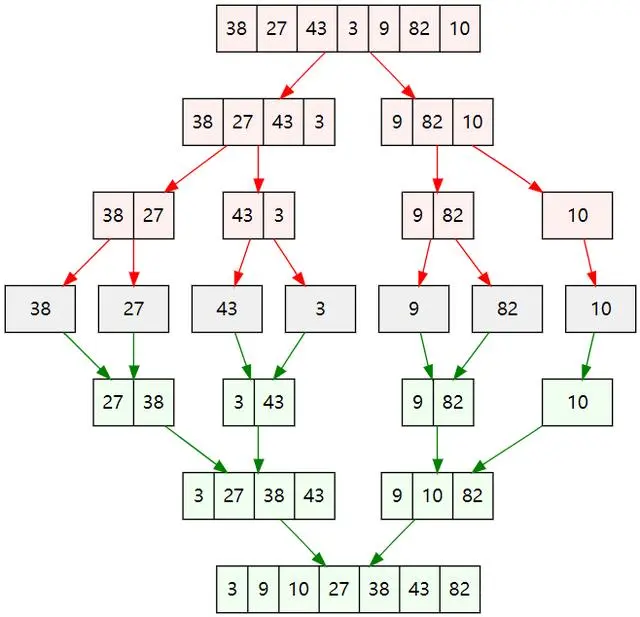

# 归并排序基础知识

- 大问题拆分成小问题递归然后合并
- 将两个有序数组合并成一个有序数组，最重要
  1. 一个新数组，加两个指针指向分别指向两个数组开头
  2. 每次将两个数组第一个较小的放到一个数组结尾，并移动指针。
- 二路归并--> 多路归并
- 大数据场景下的应用
  1. 电脑内存大小 2GB，如果对一个 40GB 的文件进行排序：归并所需的额外空间可以放在外存，使用二十路归并排序，二十个最小值获取用堆排序。所以快排是内部排序，



- 代码实现
  见[index.js](index.js)

# 经典面试题-归并排序基础

- 剑指 Offer 51. 数组中的逆序对：主要还是利用归并的思想，代码见[reversePairs.js](reversePairs.js)
- 23. 合并 K 个升序链表，分治思想，代码见[mergeKLists.ts](mergeKLists.ts)
- 148. 排序链表[sortList.ts](sortList.ts)
- 1305. 两棵二叉搜索树中的所有元素:先中序遍历为有序的，然后合并即可
- 327. 区间和的个数；
  - 原序列区间和值等于前缀和数组上两项相减的结果--->前缀和数组`sum`中有多少对满足`lower <= sum[j] - sum[i] <= upper 且  i < j`，转换后`sum[j] - lower >= sum[i] >= sum[j] - upper`，即`a <= sum[i] <= b`,而对于一个有序数组来说一切更简单
- 53. 最大子数组和
  - 先处理成前缀和
  - 找到位置 j 之前的最小值 ，并和当前值做一个差，就是最大值。

1508. 子数组和排序后的区间和


    - 纯排序实现：将所有的区间和存到入组，然后排序
    - 小顶堆实现

```js
/** 由于都是正整数
    故：
        s[0,0] < [0,1] < [0,2] < [0,3]
        s[1,1] < [1,2] < [1,3]
        s[2,2] < [2,3]
        s[3,3]
    它们都是有序的，所以问题转化为多路合并，并且在合并的过程中计算出对应的left,right 的和。

    所以将s[0,0]， s[1,1]，s[2,2]，s[3,3]先添加到优先队列中
    每次出栈一个最小，入栈最小的下一个，然后遍历right次，在这个过程中将left到right的和加起来
    **/
let qunue = new MinPriorityQueue({
  compare: (e1: Data, e2: Data) => (e1.sum < e2.sum ? -1 : 1),
});
// 入队列
for (let i = 0; i < n; i += 1) qunue.enqueue(new Data(i, i, nums[i]));

let sum = 0;
for (let i = 1; i <= right; i++) {
  let pop = qunue.dequeue();
  if (i >= left) sum += pop.sum;
  if (pop.j + 1 < n) {
    qunue.enqueue(new Data(pop.i, pop.j + 1, pop.sum + nums[pop.j + 1]));
  }
}
return sum % (1e9 + 7);
```

- 面试题 04.08. 首个共同祖先

```JS
var lowestCommonAncestor = function(root, p, q) {
    if(root === null || root === p || root === q) return root;
    const l = lowestCommonAncestor(root.left,p,q)
    const r = lowestCommonAncestor(root.right,p,q)
    if(l && r) {
        return root
    } else if(r){
        return r
    } else {
        return l
    }
};
```

- 1302. 层数最深叶子节点的和
```js
function deepestLeavesSum(root: TreeNode | null): number {
    let ans = 0
    let maxDeep = 0
    function getResult(_root,k){
        if(_root === null) return
        if(k === maxDeep) ans += _root.val // 如果当前节点深度和最大深度一样，就加起来
        // 更深的节点应该作为ans初始化
        if(k > maxDeep){
            maxDeep = k
            ans=_root.val
        } 
        getResult(_root.left,k+1)
        getResult(_root.right,k+1)
    }
    getResult(root,1)
    return ans
};
```
